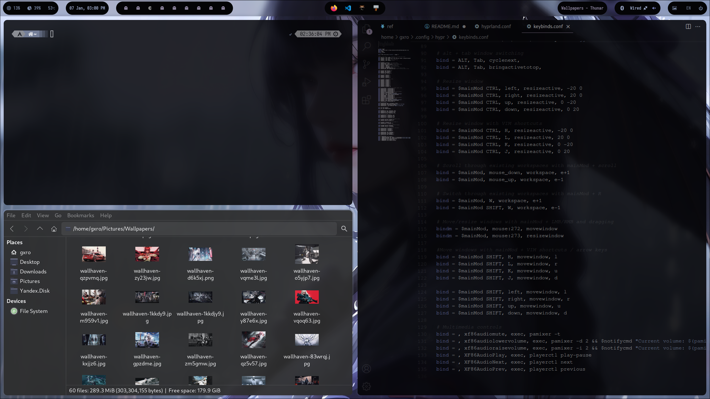
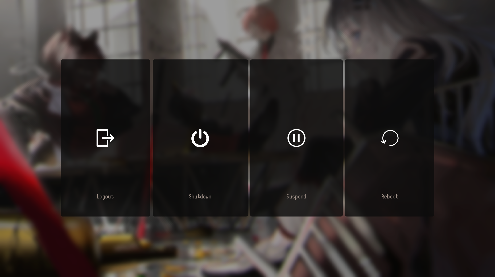

# Hyprland dots

My first attempt at ricing. It was fun.

This rice is based on pywal. There is a script that's executed on launch. It takes random wallpaper from `~/Pictures/Wallpapers` and updates some config files to style everyting. Another script does the same with a chosen wallpaper, and it's added to Thunar context menu.

This rice was made for pc so it lacks some laptop packages and features.

## Screenshots






## Keybinds

-   Toggle full screen: `Super + F`
-   Toggle floating: `Super + Space`
-   Launcher: `Super + R`
-   File manager: `Super + E`
-   Terminal: `Super + T`
-   Close active window: `Super + Q`
-   Power menu: `Super + L`
-   Firefox: `Super + B`
-   More keybinds in .config/hypr/keybinds.conf

## Installation

### Script

The script hasn't been tested yet.
```shell
git clone https://github.com/GxroZeppeli/Gxro-dots ~/Gxro-dots
cd ~/Gxro-dots
./install.sh
```

### Manual

Use your favourite AUR helper.

```shell
paru -S hyprland wlogout kitty xdg-desktop-portal-hyprland xdg-user-dirs qt5-wayland qt6-wayland networkmanager network-manager-applet bluez blueman dunst waybar rofi swww ly polkit-kde-agent nwg-look pywal-16-colors image-magick kvantum qt5ct zsh eza qview
```

Screenshots
```shell
paru -S slurp grim swappy wl-clipboard
```

Audio
```shell
paru -S pipewire pipewire-audio pipewire-jack pipewire-pulse pipewire-alsa pavucontrol pamixer
```

Thunar
```shell
paru -S thunar thunar-volman thunar-archive-plugin gvfs tumbler
```

Fonts
```shell
paru -S ttf-iosevka-nerd noto-fonts-emoji noto-fontsd-cjk otf-font-awesome
```

Firefox
```shell
paru -S firefox python-pywalfox
```

After package installation move repo's `.config` to `~/` and make scripts from repo's `bin` folder executable from everywhere.

### Hyprland monitor setup

Don't forget to change monitor settings in `~/.config/hypr/hyprland.conf`.

### VSCode

VSCode has [Wal Theme](https://marketplace.visualstudio.com/items?itemName=dlasagno.wal-theme) extension for pywal colors.

### Firefox

Besides packages install Pywalfox browser extension.

### Nvidia

Follow instructions on [Hyprland wiki](https://wiki.hyprland.org/Nvidia/). If you have black screen instead of dm run this:
```shell
nvidia-xconfig
```

### Oh My Zsh and Powerlevel10k Theme

Do these first before copying the `.zshrc` and `.p10k.zsh` files to your home directory:

-   Install Oh My Zsh by running this command:
    ```shell
    sh -c "$(curl -fsSL https://raw.githubusercontent.com/ohmyzsh/ohmyzsh/master/tools/install.sh)"
    ```
-   Install the Powerlevel10k theme:
    ```shell
    git clone --depth=1 https://github.com/romkatv/powerlevel10k.git ${ZSH_CUSTOM:-$HOME/.oh-my-zsh/custom}/themes/powerlevel10k
    ```
-   Install the syntax highlighting plugin and the autosuggestions plugin:

    ```shell
    git clone https://github.com/zsh-users/zsh-syntax-highlighting.git ${ZSH_CUSTOM:-~/.oh-my-zsh/custom}/plugins/zsh-syntax-highlighting
    ```

    ```shell
    git clone https://github.com/zsh-users/zsh-autosuggestions ${ZSH_CUSTOM:-~/.oh-my-zsh/custom}/plugins/zsh-autosuggestions
    ```

## Credits

I got inspired by these dotfiles:
- https://github.com/rchrdwllm/dotfiles/tree/master
- https://github.com/prasanthrangan/hyprdots/tree/main
- https://github.com/Roknor/hyprland-dots/tree/main